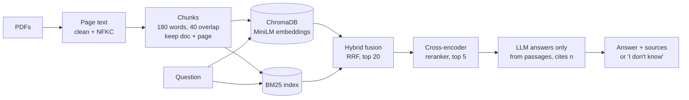
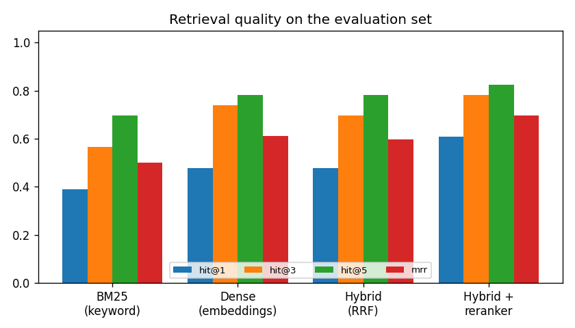

# 📚 RAG Document Q&A Assistant — with evaluation

Ask questions about PDFs and get answers **grounded in the documents, with page citations** — and an assistant that says *"I don't know"* instead of inventing an answer. Unlike most RAG demos, this one is **measured**: a hand-written test set scores retrieval, answer correctness, citation accuracy and refusals, and every design change is backed by numbers.


**Documents:** two public-domain NIST frameworks (112 pages) — the [AI Risk Management Framework (AI RMF 1.0)](https://doi.org/10.6028/NIST.AI.100-1) and its [Generative AI Profile (NIST AI 600-1)](https://doi.org/10.6028/NIST.AI.600-1). Any PDF can be added from the app.

## How it works



- **Chunking** keeps the source document and page so every answer can cite them.
- **Retrieval** combines keyword search (BM25) and semantic search (MiniLM embeddings in ChromaDB) with **reciprocal rank fusion**, then a **cross-encoder reranker** re-scores the top 20.
- **Generation** runs on a local model (**Ollama, qwen2.5 3B**, no data leaves the laptop) or on **Groq** — switch with `LLM_PROVIDER` in `.env`.

## Evaluation

`eval/questions.json` has **23 answerable questions** (each with the gold PDF pages and the facts a correct answer must contain) and **6 unanswerable ones** outside the documents (e.g. *"What fines does the EU AI Act impose?"*). Gold pages come from the documents' own structure — e.g. each generative-AI risk has a short definition on p. 8–9 *and* a detailed section 2.x — not from what the system retrieved.

### Retrieval — is the right page in the context?

| Method | Hit@1 | Hit@3 | **Hit@5** | MRR |
|---|---|---|---|---|
| BM25 (keywords) | 39% | 57% | 70% | 0.50 |
| Dense (MiniLM embeddings) | 48% | 74% | 78% | 0.61 |
| Hybrid (RRF) | 48% | 70% | 78% | 0.60 |
| **Hybrid + cross-encoder reranker** | **61%** | **78%** | **83%** | **0.70** |

The reranker is the biggest single improvement: the correct page is ranked first for **61%** of questions, up from 48%.



### Answers — local 3B model (qwen2.5:3b on a laptop CPU)

| Metric | Prompt v1 | **Prompt v2** |
|---|---|---|
| Answers containing all expected facts | 43% | **65%** |
| Expected facts mentioned (keyword recall) | 43% | **70%** |
| Answers that cite a source | 52% | **87%** |
| Answers citing a gold page | 39% | **57%** |
| Answerable questions wrongly declined | 48% | **13%** |
| **Unanswerable questions correctly declined** | **100%** | **100%** |
| Median time per answer (CPU) | 52 s | 64 s |

**What changed between v1 and v2:** the first run showed the small model *over-refusing* — it replied "I don't know" to almost half the answerable questions, even when the right passage was in its context. The refusal rule had been stated twice and too strongly. Prompt v2 states it once, only for the case where *no* passage is relevant, and asks for specific facts with an inline citation example. Wrong refusals fell from 48% to 13% **without** losing any correct refusals. (Both runs are kept in `reports/` because the prompt was tuned on the same questions it is scored on.)

**Remaining failures** are mostly vague answers from the 3B model (e.g. restating the question) and questions whose answer is spread across a list the model summarises only partly. A larger model (e.g. Llama 3.3 70B via Groq) is the obvious next step; the evaluation harness makes that comparison a single command.

## Run it

```bash
pip install -r requirements.txt
cp .env.example .env               # choose ollama (local) or groq, add a key if using Groq

python -m rag.ingest               # chunk + embed data/docs/*.pdf into ChromaDB
python -m rag.evaluate --retrieval-only   # retrieval metrics, no LLM needed
python -m rag.evaluate             # full evaluation (needs the LLM)
streamlit run app/app.py           # chat with the documents
python -m pytest -q                # tests (LLM stubbed)
```

**Local model with Ollama:** `ollama pull qwen2.5:3b`, then `ollama serve`.

## Project structure

```text
├── rag/
│   ├── ingest.py      # PDF -> clean page text -> overlapping chunks (doc + page kept)
│   ├── retrieval.py   # BM25, dense (ChromaDB), hybrid RRF, cross-encoder reranking
│   ├── llm.py         # Ollama / Groq, swappable via .env
│   ├── answer.py      # grounded prompt, citation parsing, refusal detection
│   └── evaluate.py    # retrieval + answer evaluation, charts
├── app/app.py         # Streamlit chat with sources, PDF upload, retriever choice
├── eval/questions.json
├── data/docs/         # the two NIST PDFs (public domain)
├── reports/           # evaluation results (v1 and v2 prompts), charts
└── tests/
```

## Tech stack

Python · ChromaDB · sentence-transformers (MiniLM, cross-encoder) · rank-bm25 · PyMuPDF · Ollama · Groq API · Streamlit · pytest · GitHub Actions
